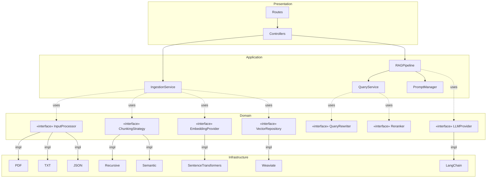

# Walkthrough — Advanced RAG Backend System

## What Was Built

A **production-ready RAG backend** with 74 Python files across Clean Architecture layers:

| Layer | Files | Key Components |
|-------|-------|---------------|
| **Domain** | 13 | 9 interface ABCs, 3 model files, exception hierarchy |
| **Infrastructure** | 19 | Input processors, Weaviate, LangChain, embeddings, chunking, reranker, cache, multimodal, Celery |
| **Application** | 8 | RAG pipeline, ingestion service, query service, prompt manager, DTOs |
| **Presentation** | 12 | Routes, controllers, schemas, 3 middlewares |
| **DI + Config** | 4 | Container (Composition Root), settings |

## Architecture Summary

## Design Patterns Applied

- **Factory** — [InputProcessorFactory](file:///e:/20252/DATN_vibe_code/src/rag_backend/infrastructure/input_processors/factory.py#21-74) resolves processors by file extension
- **Strategy** — [ChunkingStrategy](file:///e:/20252/DATN_vibe_code/src/rag_backend/domain/interfaces/chunking_strategy.py#10-49) allows runtime selection of chunking algorithms
- **Adapter** — LLM, embedding, and input processors wrap external libraries
- **Repository** — [VectorRepository](file:///e:/20252/DATN_vibe_code/src/rag_backend/domain/interfaces/vector_repository.py#11-114) abstracts all vector DB operations
- **DI** — Central [Container](file:///e:/20252/DATN_vibe_code/src/rag_backend/di/container.py#57-212) (Composition Root) wires everything; swapping = 1 line change

## Key Files

- Entry point: [main.py](file:///e:/20252/DATN_vibe_code/src/rag_backend/main.py)
- DI container: [container.py](file:///e:/20252/DATN_vibe_code/src/rag_backend/di/container.py)
- RAG pipeline: [rag_pipeline.py](file:///e:/20252/DATN_vibe_code/src/rag_backend/application/services/rag_pipeline.py)
- Settings: [settings.py](file:///e:/20252/DATN_vibe_code/src/rag_backend/config/settings.py)
- Extensibility guide: [README.md](file:///e:/20252/DATN_vibe_code/README.md)

## Verified

- ✅ 74 Python files created across all layers
- ✅ Full folder structure matches implementation plan
- ✅ All interfaces have concrete implementations
- ✅ README includes extensibility examples (add input type, swap vector DB, swap LLM, add chunking strategy)
